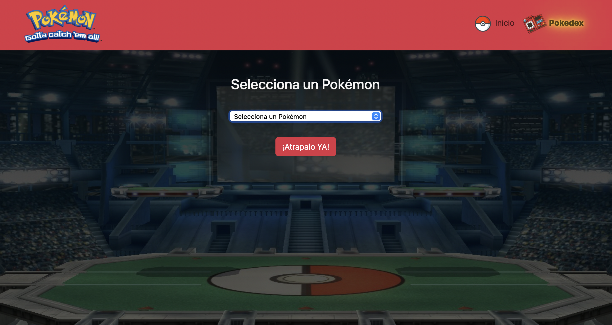
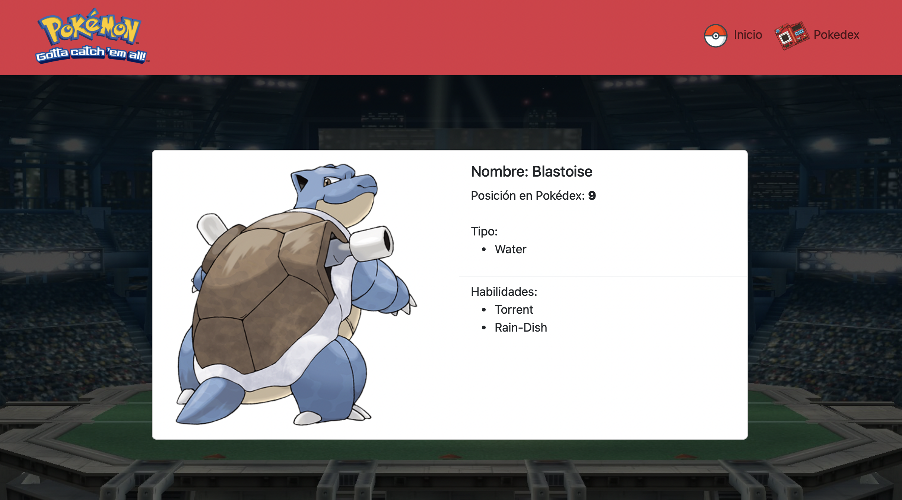
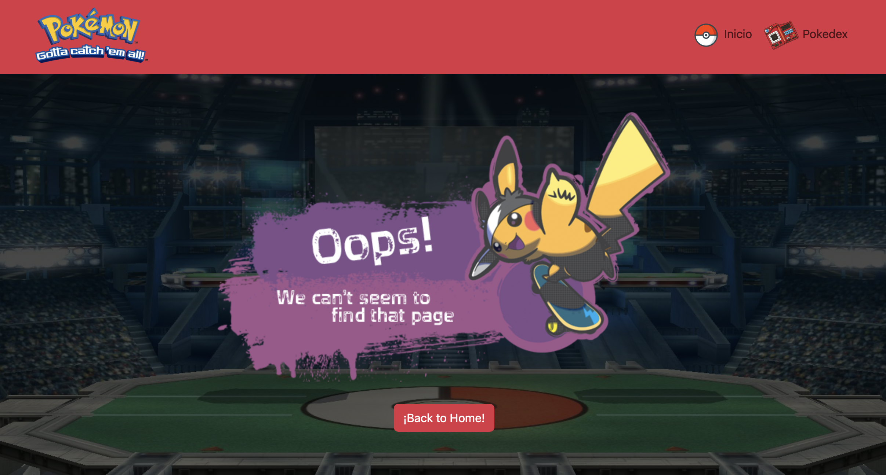

Desafío - Router II (Pokedex)

Descripción:
En este desafío pondremos a prueba tus nuevas habilidades con React Router para consolidar el redireccionamiento de rutas, la obtención de parámetros en una ruta y la asignación de una clase activa a la ruta que se esté visitando en una SPA.

